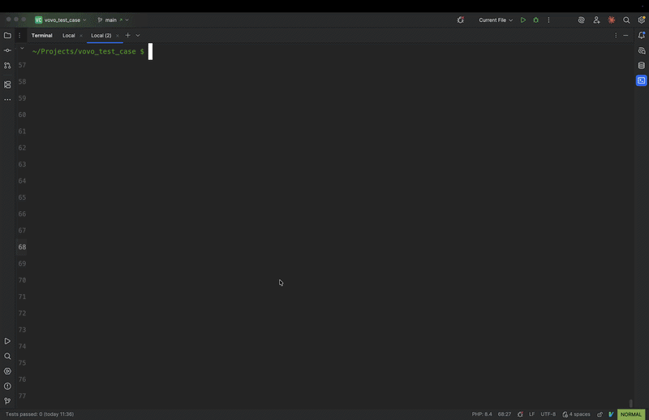

# Application requirements

1. PHP 8;
2. Composer;
3. Docker.

# Application installation

    $ composer install

# Local development

### Installation

    $ php artisan sail:install

### Default usage of sail

    $ ./vendor/bin/sail

### Alias

To use a short version of command `./vendor/bin/sail` add next alias in `~/.zshrc` or `~/.bashrc`:

    alias sail=sh $([ -f sail ] && echo sail || echo vendor/bin/sail)'

### Docker container over laravel sail

**Note**: all further commands without the short [alias](#alias) could be run only with `./vendor/bin/sail`

Run container

    $ sail up

Silent run container

    $ sail up -d

Shutdown the container

    $ sail stop

### Migration

    $ sail artisan migrate:fresh

    $ sail artisan db:seed --class=DemoProductSeeder

### Product names

Chair, Car, Computer, Gloves, Pants, Shirt, Table, Shoes, Hat, Plate, Knife, Bottle, Coat, Lamp, Keyboard, Bag, Bench, Clock, Watch, Wallet

### cURL request

Demo

Basic cURL request:

    curl -X GET "http://localhost/api/products?q=watch" \                                  
    -H "Accept: application/json"

Advanced cURL request with filters:

    curl -X GET "http://localhost/api/products?q=watch&price_from=1500&price_to=3500&in_stock=0&sort=price_desc&page_size=4" \
    -H "Accept: application/json"

JQ exists and installed:

    curl -X GET "http://localhost/api/products?q=watch" \                                  
    -H "Accept: application/json" | jq

    curl -X GET "http://localhost/api/products?q=watch&price_from=1500&price_to=3500&in_stock=0&sort=price_desc&page_size=4" \
    -H "Accept: application/json" | jq
